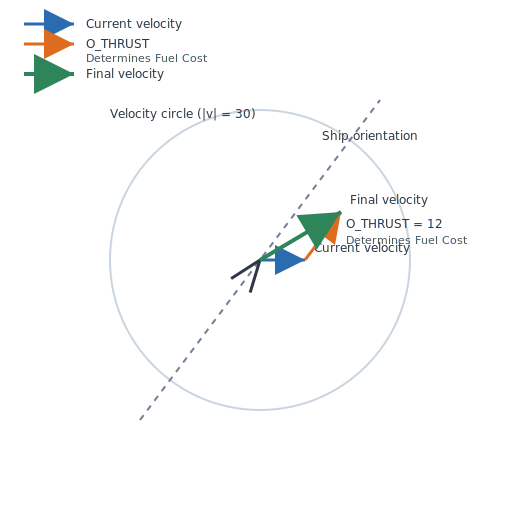
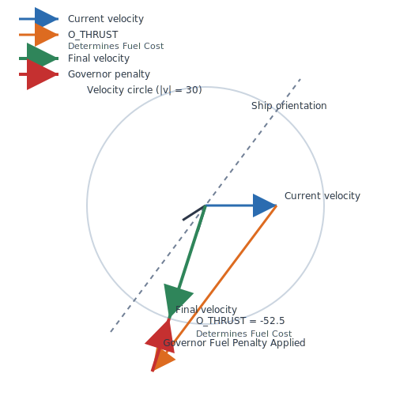

# Contest Navigation Reference (Contestants)

> **Scope.** This guide describes the **default modern flight model** used by the tournament server. Legacy compatibility modes that recreate the 1998 mechanics behave differently and are not covered here.

## 1. Orders at a Glance
- **One update per second:** Every ship issues at most one order packet per second. The engine then simulates a full second of movement using that input.
- **Available orders:**
  - `O_THRUST` (Δv along current facing, forward positive, reverse negative).
  - `O_TURN` (change in orientation, radians).
  - `O_LASER` (beam length).
  - `O_SHIELD` (shield increase).
  - `O_JETTISON` (separate helper to eject vinyl or fuel).
- **Order restrictions:**
  - **Movement orders (mutually exclusive):** At most ONE of `O_THRUST`, `O_TURN`, or `O_JETTISON` may be issued per turn. Issuing any of these cancels the other two.
  - **Combat/defense orders (combinable):** Both `O_LASER` and `O_SHIELD` may be issued every turn, and can be combined with any movement order.

## 2. Coordinate System & World Geometry
- **World:** 1024 × 1024 torus. Leaving one edge wraps to the opposite edge without losing speed.
- **Facing vs motion:** Orientation is independent of velocity. A ship can drift sideways relative to its nose.
- **Angles:** Radians, increasing counter-clockwise. 0 radians points right, π/2 points “up” in mathematical terms. The observer UI renders +Y downward, so visuals appear inverted.

## 3. Movement Fundamentals
- **Velocity clamping:** Ship speed is limited to 30 units/second. If cumulative thrust would exceed that, the engine trims the change to stay on the 30-unit circle. Excess thrust still consumes fuel (see developer guide).
- **Thrust range:** ±60 units/second of Δv per turn along the ship’s nose.
- **Turning:** Turn orders are normalized to ±π radians (shortest path). If you request a turn of +3π/2 radians (270° clockwise), the engine normalizes it to -π/2 radians (90° counter-clockwise) and charges fuel for the shorter π/2 rotation. You cannot choose to turn "the long way around." Once a turn completes, angular velocity resets to zero (no spinning).
- **Drift:** In the absence of thrust or collisions, ships retain their current velocity indefinitely.
- **Fine timestep:** Behind the scenes the engine applies thrust and turn in several smaller slices inside each one-second turn. This improves numerical stability but may produce slight deviations from simple “thrust × dt” mental math.

## 4. Docking & Undocking
- **Docking:** Colliding with **any station** (friendly or enemy) has the following effects:
  - Teleports the ship to the station center
  - Zeroes velocity
  - Sets docked state (docked ships cannot be hit by other objects)
  - **Immediately transfers all vinyl cargo** from the ship to the station's vinyl store, **increasing the score of the team that owns that station**
  - **Important:** If you dock at an enemy station, you give them your vinyl!
- **Launch:** To launch from a docked state, issue a thrust order (positive or negative). The station will teleport the ship 48 units away from the station center along the direction of the ship's orientation (or the opposite direction if thrust is negative), with velocity set to zero. After teleportation, the thrust order is applied. **The entire launch turn costs no fuel** - you can thrust at any magnitude (up to ±60 units/second) regardless of your fuel reserves. After the launch turn completes, normal fuel costs resume.

## 5. Jettison
- Ships can eject vinyl (cargo) or uranium (fuel) as small asteroids.
- Jettison occurs before movement. A ship can clear cargo space mid-turn and immediately collect a new asteroid in the same second.

## 6. Lasers & Shields Timing
- **Shields:** Applied at the start of the turn before movement. Fuel is consumed immediately.
- **Lasers:** Fired after the full one-second movement finishes. Firing while docked is not allowed.

## 7. Practical Tips

### Velocity Clamping and Strategic "Pseudo-Turns"

When planning maneuvers, consider the 30 units/second speed cap: the final ship velocity will be along the vector path of `ship_velocity_current + thrust_velocity`; however, the magnitude cannot exceed 30 units/second, and fuel cost penalties are applied for attempts to exceed this speed.

**However**, this can be advantageous for performing **pseudo-turns with thrust only** - by thrusting in a direction that would exceed the speed cap, you can change your direction of travel without using a turn order! See the diagrams below:

| Current Velocity + Thrust Delta-V ≤ Maxspeed | Current Velocity + Thrust Delta-V > Maxspeed |
|:---:|:---:|
| **Positive thrust case:**  | **Positive thrust case:**  |
| **Negative thrust case:**  | **Negative thrust case:**  |

In the "exceeds limit" cases (right column), notice how the ship changes direction by thrusting against or perpendicular to its current velocity. The excess thrust is wasted (and costs extra fuel via governor penalties), but this technique allows you to change direction while keeping your ship oriented in a specific direction (e.g., pointed at an enemy for laser firing).

### Other Tips
- **Ship orientation is independent from velocity** - turn to the heading you wish to direct thrust toward before issuing thrust orders. Remember that angular velocity resets to zero after each turn (no spinning).
- Wraparound matters: shortest travel vectors often cross an edge.

For deeper implementation details (fuel formulas, governor penalties, sub-step scheduling, collision sequencing), see `CONTEST_NAVIGATION_FOR_DEVS.md` and `CONTEST_RULES.md`.
