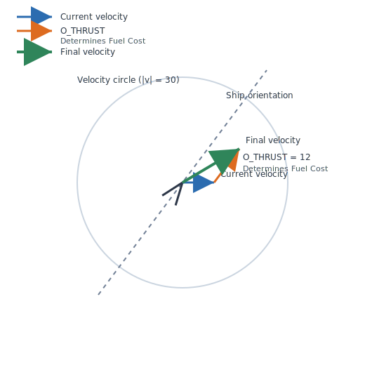
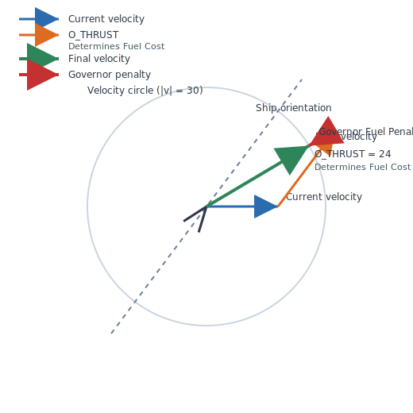
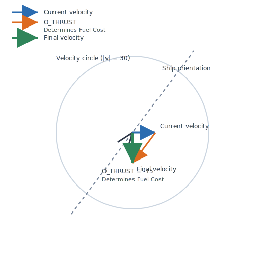
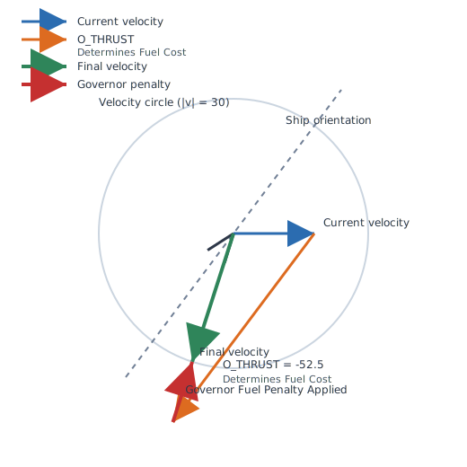

# MechMania IV: The Vinyl Frontier - Contest Rules

## Game Overview
MechMania IV is a 2D space resource collection and combat game where two teams compete to collect vinyl (the primary resource) while managing fuel and avoiding or engaging in combat. The contest runs for 300 seconds of simulated time.

## Playing Field

### World Dimensions
- **Size:** 1024 × 1024 units (from [-512, 512) on both X and Y axes)
- **Topology:** Toroidal (edges wrap around) - objects leaving one edge appear on the opposite edge
- **Coordinate System:** Continuous floating-point coordinates

### Initial World Setup
- **2 Teams:** Each with 1 station and 4 ships
- **Station Placement:**
  - Team 0: (-256, -256) - bottom-left quadrant
  - Team 1: (256, 256) - top-right quadrant
- **Asteroids:** Randomly distributed vinyl and uranium asteroids of varying sizes

## Ships

### Configuration
At initialization, each team can allocate their ships' capacity between fuel and cargo:
- **Total Capacity:** 60 tons per ship
- **Default Split:** 30 tons fuel, 30 tons cargo
- **Customizable:** Teams can adjust the fuel/cargo ratio at game start
- **Shield Capacity:** 8000 units (effectively unlimited)
- **Mass:** 10 tons (empty ship) + current fuel + current vinyl cargo
- **Maximum Speed:** 30 units/second
- **Size:** A radius 12 circle

### Ship Capabilities
Ships can perform the following actions each turn:
1. **Thrust** - Accelerate forward or backward
2. **Turn** - Rotate to change heading
3. **Shoot Laser** - Fire an energy beam
4. **Charge Shield** - Add energy to defensive shields
5. **Jettison** - Eject cargo or fuel into space

## Resources

### Vinyl (Primary Resource)
- **Color:** Purple asteroids
- **Collection:** Ships collect vinyl by colliding with vinyl asteroids
- **Storage:** Stored in ship's cargo hold
- **Scoring:** Deposited at your station to score points
- **Victory:** Team with most vinyl at their station wins

### Uranium (Fuel)
- **Color:** Green asteroids
- **Collection:** Ships collect uranium by colliding with uranium asteroids
- **Storage:** Directly added to ship's fuel tank
- **Usage:** Powers all ship operations

## Movement and Physics

### Thrust Mechanics
- **Fuel Cost:** 1 ton of fuel accelerates a 10-ton ship from 0 to 180 units/second (6 × max speed)
- **Formula:** Fuel = |thrust| × ship_mass / (6 × max_speed × empty_mass)
- **Direction:** Can thrust forward (positive) or backward (negative)
- **While Docked:** No fuel consumed for thrust

### Rotation Mechanics
- **Fuel Cost:** 1 ton of fuel rotates a 10-ton ship 6 full circles (12π radians)
- **Formula:** Fuel = |rotation| × ship_mass / (6 × 2π × empty_mass)
- **While Docked:** No fuel consumed for rotation
- **No Angular Momentum:** After each turn order to a desired heading a ship does not continue to rotate

### Physics
- **Momentum:** Ships maintain velocity when not thrusting (Newtonian physics)
- **Mass Effects:** More cargo/fuel makes ship heavier, requiring more fuel to maneuver
- **Maximum Velocity:** 30 units/second (enforced)

### Maximum Velocity Enforcement

Ships can issue thrust orders requesting for a delta-v of up to 60 in their current orientation either forwards or backwards (reverse thrust).

The Ships velocity after a thurst command, however, is limited to a radius 30 "speed circle."

Overthursting will result in a velcity of 30 in the direction of what the full overthrusted heading would have been.

Consider these examples:

| Current Velocity + Thrust Delta-V <= Maxspeed | Current Velocity + Thrust Delta-V > Maxspeed |
|:---:|:---:|
| **Positive thrust case:**  | **Positive thrust case:**  |
| **Negative thrust case:**  | **Negative thrust case:**  |
## Combat System

### Lasers
- **Range:** Variable (set by ship) up to 512 units long
- **Fuel Cost:** 1 ton per 50 units of beam length
- **Formula:** Fuel = beam_length / 50
- **Damage:** 30*( L - D ) / 1000 shield units where L is the length of the fired beam and D is the distance to the target.
- **Restrictions:** Cannot fire while docked
- **Targeting:** Hits first object in line of sight

### Laser Effects on Different Objects
- **Enemy Ships:** Damages shields, destroys ship if shields depleted
- **Asteroids:** Breaks large asteroids into smaller pieces if at least 1000 damage is done (otherwise no effect)
- **Stations:** Reduces stored vinyl (1 ton vinyl lost per 1000 points of damage)
- **Friendly Fire:** Can damage your own ships/station

### Shields
- **Purpose:** Protect ship from damage
- **Fuel Cost:** 1:1 ratio (1 ton fuel = 1 shield unit)
- **Maximum:** 8000 units (effectively unlimited)
- **Damage Sources:**
  - Laser hits: beam_length / 1000 shield damage
  - Collisions: relative_velocity*mass_of_collided_object / 1000 shield damage
- **Destruction:** Ship destroyed when shields reach negative value

## Collisions

### Ship-Asteroid Collisions
- **Small Asteroids (fits in hold):**
  - Uranium → Added to fuel tank
  - Vinyl → Added to cargo hold
  - Asteroid destroyed
- **Large Asteroids (doesn't fit):**
  - Ship takes collision damage (relative_velocity*asteroid_mass / 1000)
  - Asteroid destroyed and either 3 smaller asteroids are created, or the asteroid is reduced to useless space dust if the resulting size would be too small
  - Both objects bounce apart

### Ship-Ship Collisions
- **Damage:** Both ships take relative_momentum / 1000 shield damage
- **Physics:** Elastic collision (both ships bounce)

### Ship-Station Collisions

#### Your Own Station
- **Docking:** Ship becomes stationary at station
- **Cargo Transfer:** All vinyl automatically deposited (added to team score)
- **Fuel Conservation:** While docked, thrust and turn consume NO fuel (free maneuvering)
- **Fuel Tank:** NOT refilled - remains at pre-docking level
- **Shield Recharge:** Manual (use shield charge order with actual fuel from tank)
- **Protection:** Immune to damage while docked
- **Orientation:** You can change your heading while docked (costs no fuel)
- **Departure:** Thrust to leave station (costs no fuel while still docked)

#### Enemy Station
- **Same as your station:** THIS MEANS YOU CAN GIVE VINYL TO THE ENEMY STATION!

### Station-Asteroid Collisions
- **Damage:** Station takes minor damage to vinyl stores
- **Physics:** Asteroid bounces off

## Orders and Actions

### Order System
- **Simultaneous:** All orders can be issued in same turn
- **Compatibility:** Shield and Lasers can be used every turn. Only one of Jettison, Turn, or Thrust may be used per turn.
- **Execution:** Physics motion happens before combat each turn

### Order Limits
- **Shield:** Limited by available fuel
- **Laser:** Limited by fuel (Beam length/50 fuel cost), maximum beam length is 512, and cannot fire while docked
- **Thrust:** ±60 units/second change (limited by fuel)
- **Turn:** ±2π radians (limited by fuel). Note - you turn to the desired heading and stop - ships don't continue to spin after turning.
- **Jettison:** Limited by cargo/fuel carried

### Jettison Mechanics
- **Purpose:** Create new asteroids from ship resources, lightens ship to reduce fuel costs of maneuvering, prevent docking at enemy station with Vinyl, ??throw rocks at enemy ships??
- **Minimum:** Must jettison at least 3 tons, specifying a lower amount will have no effect
- **Result:** Creates new asteroid at ship location

## Information Available to Teams

### Complete Knowledge
Teams have access to:
- Position and velocity of all objects (ships, asteroids, stations)
- Type and size of all asteroids
- Own ships' fuel, cargo, and shields
- All teams' stations and vinyl scores
- Total game time elapsed

### Limited Knowledge
Teams do NOT know:
- Enemy ships' fuel levels
- Enemy ships' cargo contents
- Enemy ships' shield levels
- Enemy ships' planned orders

### Communication
- Teams can print text messages visible to observers
- Messages displayed in observer console
- Maximum 512 characters per message buffer

## Victory Conditions

### Game Duration
- **Length:** 300 seconds of simulated time
- **Time Step:** Variable (typically 1 second per simulation cycle)

### Scoring
- **Primary Score:** Total vinyl stored at team's station
- **Measurement:** In tons (floating point)
- **Winner:** Team with highest vinyl score when time expires

### Tiebreakers
1. Most vinyl at station
2. Most ships surviving
3. Total mass of team's ships (fuel + cargo + base mass)

## Strategic Considerations

### Fuel Management
- Starting fuel must last entire game (unless collecting uranium)
- **Stations do NOT refill fuel** - only provide free thrust/turn while docked
- More cargo capacity means less fuel capacity
- Heavier ships (full of cargo) require more fuel to maneuver
- Can jettison cargo in emergency to reduce mass
- Uranium asteroids are the ONLY way to refuel during the game

### Combat vs Collection
- Combat consumes significant fuel (lasers, maneuvering)
- Destroyed ships cannot collect resources
- Can attack enemy stations to reduce their score
- Shield maintenance requires fuel investment

### Asteroid Management
- Large asteroids can be broken into smaller pieces with lasers (or crashing into them with ships)
- Small pieces easier to collect but require more trips
- Uranium asteroids provide fuel but don't score points
- Can jettison resources to create obstacles/distractions

### Station Strategy
- Regular returns to base required to deposit vinyl
- Docking provides free rotation and departure thrust
- Stations are vulnerable to laser attacks

## Technical Notes

### Turn Sequence
1. Teams submit orders
2. Physics simulation (movement, collisions)
   * Internally handled in five, 0.2 second tics, per 1 second game turn
3. Combat resolution (lasers, damage)
4. Resource collection
5. Score updates
6. World state broadcast

### Coordinate System
- Origin (0,0) at world center
- Positive X to the right
- Positive Y upward
- Angles in radians (0 = east,πPI/2 = north)

### Units
- Distance: miles
- Mass: tons
- Time: seconds
- Speed: miles/second
- Fuel: tons
- Damage: shield units
